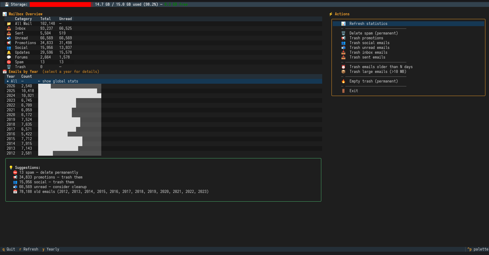
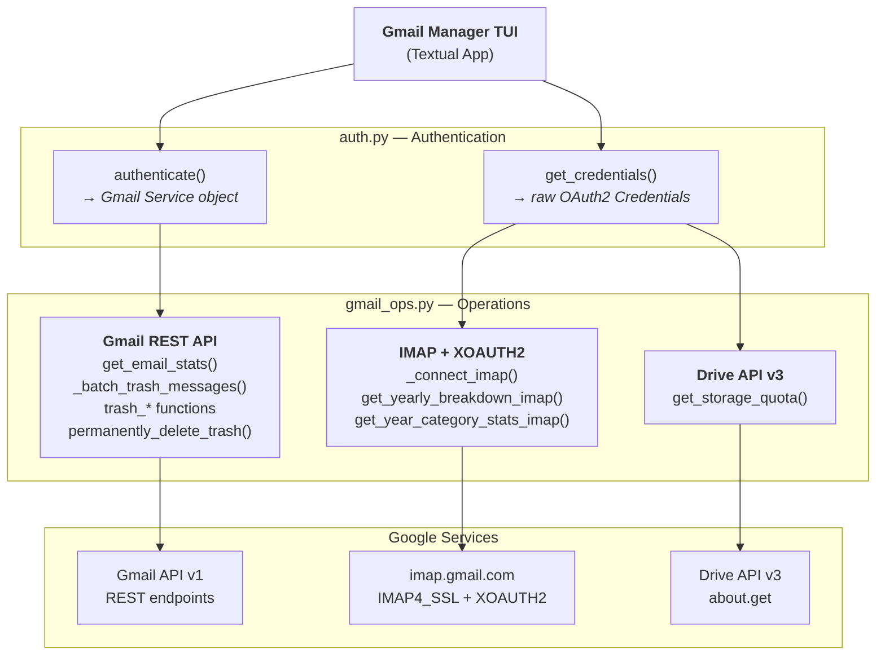
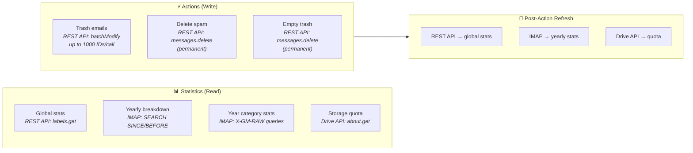
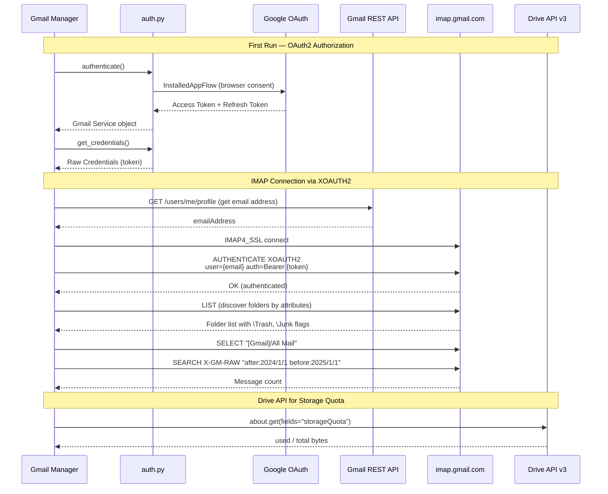

# 📧 Gmail Manager TUI

A terminal-based Gmail manager that shows your mailbox statistics and helps you clean up emails.




## Features

- **Mailbox overview** — total, unread, spam, promotions, social, and more
- **Storage quota bar** — shows Google account storage usage with color-coded progress bar
- **Yearly breakdown** — visualize email volume by year with bar charts
- **Year drill-down** — select a year to see per-category stats for that year
- **Year-scoped actions** — all cleanup actions can target a specific year
- **Google Drive folders** — list root-level Drive folders sorted by size with visual bars, archive or trash folders
- **Smart suggestions** — get cleanup recommendations based on your mailbox
- **Cleanup actions:**
  - 🗑 Permanently delete spam
  - 📢 Trash promotional emails
  - 👥 Trash social emails
  - 📬 Trash unread emails
  - 📥 Trash inbox emails
  - 📤 Trash sent emails
  - ⏰ Trash emails older than N days
  - 📦 Trash large emails (>10MB)
  - 🔥 Empty trash (permanently delete trashed emails)
- **Drive folder actions:**
  - 📁 Browse root folders sorted by total size (descending)
  - 🗑 Trash a folder
  - 📦 Archive a folder (moves into an "Archive" folder in Drive root)

## Prerequisites

- Python 3.8 or newer
- A Google account (Gmail) with **2-Step Verification (2FA) enabled**
- A web browser (for the one-time OAuth authorization)

> **2FA is required:** Google requires 2-Step Verification to be enabled on your account before you can authorize third-party apps with OAuth. To enable it, go to [Google Account → Security → 2-Step Verification](https://myaccount.google.com/signinoptions/two-step-verification) and follow the prompts.

## Setup — Step by Step

### Step 1: Create a Google Cloud Project

1. Open [Google Cloud Console](https://console.cloud.google.com/) in your browser
2. Click the project dropdown at the top left (next to "Google Cloud")
3. Click **New Project**
4. Enter a project name (e.g., `gmail-manager`) and click **Create**
5. Make sure your new project is selected in the dropdown

### Step 2: Enable the Gmail API

1. In the left sidebar, go to **APIs & Services → Library**
2. In the search bar, type **Gmail API**
3. Click on **Gmail API** in the results
4. Click the blue **Enable** button
5. Wait for it to finish enabling

### Step 3: Enable the Google Drive API

The Drive API is used to display your Google account storage quota (used / total).

1. Go back to **APIs & Services → Library**
2. In the search bar, type **Google Drive API**
3. Click on **Google Drive API** in the results
4. Click the blue **Enable** button
5. Wait for it to finish enabling

### Step 4: Configure the OAuth Consent Screen

> **This step is required before you can create credentials.**
> Both the Gmail API and Google Drive API must be enabled (Steps 2–3) before proceeding.

1. In the left sidebar, go to **APIs & Services → OAuth consent screen**
2. Click **Get started** (or **Configure consent screen** if shown)
3. Fill in the form:
   - **App name**: `Gmail Manager` (or any name you like)
   - **User support email**: select your email from the dropdown
   - **Developer contact information**: enter your email address
4. Click **Save and Continue**
5. On the **Scopes** page, click **Add or Remove Scopes**
   - Search for `https://mail.google.com/` and check it
   - Also search for `https://www.googleapis.com/auth/drive` and check it
   - Click **Update** at the bottom
   - Click **Save and Continue**
6. On the **Test users** page:
   - Click **+ Add Users**
   - Enter your Gmail address (the one you want to manage)
   - Click **Add**
   - Click **Save and Continue**
7. Click **Back to Dashboard**

> **Important:** Your app will be in **"Testing"** mode by default. Only the email addresses you added as test users can authorize. If you want anyone to use it, click **Publish App** on the consent screen page (no Google review needed for personal-use apps with <100 users).

### Step 5: Create OAuth 2.0 Credentials

1. In the left sidebar, go to **APIs & Services → Credentials**
2. Click **+ CREATE CREDENTIALS** at the top
3. Select **OAuth client ID**
4. For **Application type**, choose **Desktop app**
5. Name it anything (e.g., `Gmail Manager Desktop`)
6. Click **Create**
7. A dialog appears with your Client ID and Client Secret — click **Download JSON**
8. Rename the downloaded file to **`credentials.json`**
9. Move it into this project's directory (next to `gmail_manager.py`)

Your directory should look like:
```
gmail-manager/
├── credentials.json    ← you just added this
├── gmail_manager.py
├── auth.py
├── gmail_ops.py
├── requirements.txt
└── ...
```

### Step 6: Install Python Dependencies

```bash
pip install -r requirements.txt
```

### Step 7: Run the Application

```bash
python gmail_manager.py
```

### Step 8: Authorize (First Run Only)

1. A browser window will open automatically showing Google's consent page
2. Select the Google account you want to manage
3. You may see a warning **"Google hasn't verified this app"** — click **Continue** (this is your own app)
4. Grant the requested permissions (Gmail access and Google Drive access)
5. The browser will show "The authentication flow has completed" — you can close it
6. Back in the terminal, the app will load and display your mailbox statistics

A `token.json` file is saved locally so you won't need to re-authorize on future runs. If you revoke access or the token expires, simply delete `token.json` and run again.

> **Note:** If you previously authorized without the full Drive API scope (e.g., only `drive.metadata.readonly`), delete `token.json` and re-run the app to authorize with the updated scopes. The app will detect stale scopes and prompt re-authentication automatically.

## Usage

Once running, you'll see a split-pane Textual TUI with three panels:

- **Left panel — Statistics & Yearly Breakdown:**
  - A storage quota bar at the top showing used/total space (color-coded green → yellow → red)
  - Category breakdown (All Mail, Inbox, Promotions, Spam, etc.) with total and unread counts
  - Yearly breakdown with bar charts showing email volume per year

- **Right panel — Actions:**
  - A list of cleanup actions (trash promotions, spam, inbox, sent, etc.)
  - Select a year in the yearly panel to scope all actions to that year
  - Select "✦ All" to return to the global view

- **Navigation:**
  - Use **arrow keys** or **mouse** to navigate panels and select items
  - Press **Tab** to switch between panels
  - Press **D** to open the Google Drive folder browser
  - Every destructive action shows a confirmation dialog with clickable **Yes/No** buttons (or keyboard **Y/N**)
  - Press **Q** to quit

## Safety

- All cleanup actions require **explicit confirmation** before executing
- Most operations move emails to **Trash** (recoverable for 30 days in Gmail)
- Only spam deletion and **Empty Trash** are **permanent** (uses Gmail's permanent delete API)
- Statistics are refreshed automatically after each cleanup action

## Troubleshooting

| Problem | Solution |
|---------|----------|
| **"Access blocked: app has not completed Google verification"** | Go to **OAuth consent screen → Test users** and add your Gmail address, or click **Publish App** |
| **"Missing credentials.json"** | Download OAuth credentials (Step 4) and place the file in this directory |
| **Token expired / permission errors** | Delete `token.json` and run again to re-authorize |
| **Browser doesn't open** | Copy the URL from the terminal and paste it into your browser manually |
| **Rate limit errors** | The app pauses between batches automatically; for very large mailboxes, run cleanup actions in stages |
| **Storage quota not showing** | Enable the **Google Drive API** in your Cloud Console (Step 3) and delete `token.json` to re-authorize with the new scope |

## Files

| File | Purpose |
|------|---------|
| `gmail_manager.py` | Main TUI application |
| `auth.py` | OAuth2 authentication |
| `gmail_ops.py` | Gmail API operations || `drive_ops.py` | Google Drive API operations || `credentials.json` | Your OAuth credentials **(do not commit!)** |
| `token.json` | Auto-generated auth token **(do not commit!)** |

## Architecture

Gmail Manager uses a **hybrid protocol model** — combining the Gmail REST API, IMAP with XOAUTH2, and the Drive API — each chosen for what it does best.

### Why Hybrid?

| Need | Protocol | Reason |
|------|----------|--------|
| Global mailbox stats | **Gmail REST API** | Fast label metadata, no folder enumeration needed |
| Per-year email counts | **IMAP** | Gmail REST API caps `resultSizeEstimate` at ~501; IMAP `SEARCH` returns exact counts |
| Per-year category breakdown | **IMAP** | `X-GM-RAW` queries on IMAP support Gmail search syntax within specific folders |
| Trash/Spam counts by year | **IMAP** | Must select locale-specific folders (`\Trash`, `\Junk` attributes); REST labels don't support year-scoped counts |
| Bulk move/delete emails | **Gmail REST API** | `batchModify` handles up to 1000 messages per call |
| Storage quota | **Drive API v3** | Gmail API doesn't expose account storage; Drive's `about.get` does |
| Drive folder sizes | **Drive API v3** | `files.list` fetches all files; sizes computed via in-memory parent tree |
| Trash/archive folders | **Drive API v3** | `files.update` to trash or reparent folders |

### High-Level Component Diagram



### Protocol Flow — Statistics vs Actions



### XOAUTH2 Authentication Flow



### Function → Protocol Map

| Module | Function | Protocol |
|--------|----------|----------|
| auth.py | `authenticate()` | OAuth2 → Gmail REST service |
| auth.py | `get_credentials()` | OAuth2 → raw credentials |
| gmail_ops.py | `get_email_stats()` | Gmail REST API |
| gmail_ops.py | `get_yearly_breakdown_imap()` | IMAP (SEARCH SINCE/BEFORE) |
| gmail_ops.py | `get_year_category_stats_imap()` | IMAP (X-GM-RAW + folder discovery) |
| gmail_ops.py | `get_storage_quota()` | Drive API v3 |
| gmail_ops.py | `_batch_trash_messages()` | Gmail REST API (batchModify) |
| gmail_ops.py | `trash_*()` (all variants) | Gmail REST API |
| gmail_ops.py | `permanently_delete_trash()` | Gmail REST API (messages.delete) |
| gmail_ops.py | `_connect_imap()` | IMAP + REST API (profile lookup) |

## Security

The `.gitignore` is configured to prevent committing sensitive files:

```
credentials.json   # OAuth client secret
token.json         # User auth token
__pycache__/       # Python bytecode
.env               # Environment variables
```

**Never share** `credentials.json` or `token.json` — they grant full access to your Gmail account.

## License

See [LICENSE](LICENSE) file.
